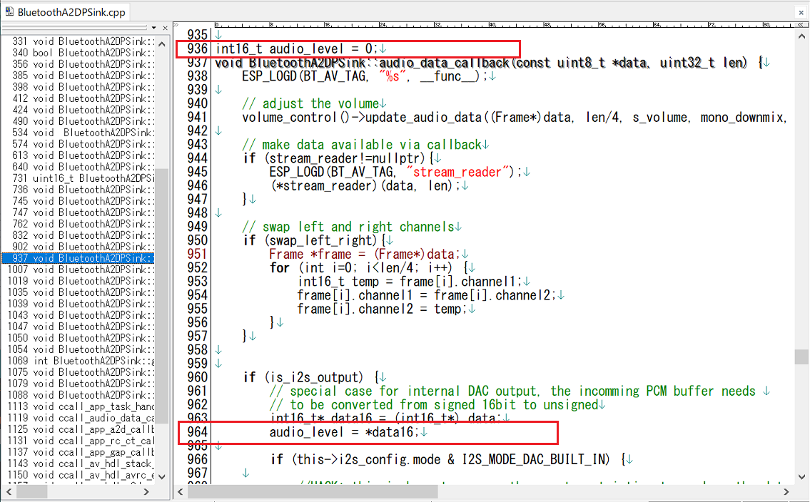

# M5Stack_Avatar_BTSPK
Bluetooth Speaker対応のM5Stack_Avatarです。 
スピーカーの音に合わせてAvatarの口が動きます（リップシンク）。 

---
### このプログラムを動かすのに必要な物 ###
* [M5Stack](http://www.m5stack.com/ "Title") (M5Stack Core2、M5Stack Core2 for AWS、M5Stack Grayで動作確認をしました。) 
* Arduino IDE (バージョン 1.8.15で動作確認をしました。) 
* [M5Stack-Avatar](https://github.com/meganetaaan/m5stack-avatar/ "Title")ライブラリ(バージョン 0.7.3で動作確認をしました。) 
* [ESP32-A2DP](https://github.com/pschatzmann/ESP32-A2DP/ "Title")ライブラリ 

### 事前にESP32-A2DPライブラリを変更しておきます ###
* "BluetoothA2DPSink.cpp"の下図赤枠部分を追加します。 
 
 
---
### 使い方 ###
* スマホなどでペアリングを選択すると"Avatar"というデバイスが表示されるので選択して接続してください。
  

